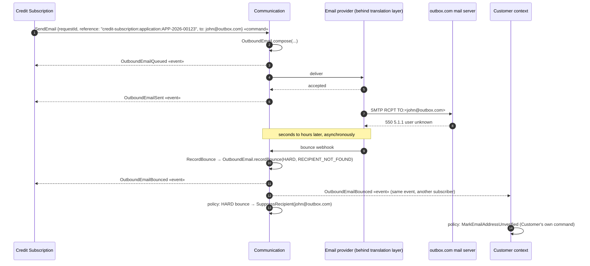

# ADR-001: Email in the Communication Context — Aggregates, the `SendEmail` Command and Email Events

**Status:** Accepted (revised)
**Date:** 2026-09-15 · **Revised:** 2026-09-21
**Deciders:** Pascoal Bayonne (Tech Lead), Communication domain team
**Bounded context:** Communication (bank: credit & loan subscription platform)
**Tags:** DDD, tactical design, strategic design, event-driven architecture, commands vs events, naming, Kafka
**Related:** [ADR-002 — Kafka Topic Layout and Event-Type Strategy](ADR-002-kafka-topic-and-event-type-strategy.md) (how these messages are laid out in topics, keyed, ordered and evolved)

### Revision history

| Date | Change |
|---|---|
| 2026-09-15 | Initial decision: two aggregates, `OutboundEmail` and `InboundEmail`. |
| 2026-09-18 | Added commands vs events. Sending is now the `SendEmail` command, owned by Communication. Delivery outcomes are named events (`OutboundEmailRejected`, `OutboundEmailDelivered`, `OutboundEmailBounced`, …). Delivery is tracked per recipient. Rejected a catch-all `EmailNotSent` event. Renamed `DeliveryStatus` to `DispatchStatus`. Dropped the `Command` suffix from class names. |
| 2026-09-18 | Linked to [ADR-002](ADR-002-kafka-topic-and-event-type-strategy.md). Topic layout, schema strategy, ordering and evolution rules now live there. `SendEmail` travels inside an `OutboundEmailCommand` envelope. |
| 2026-09-21 | Reworked for our domain: the senders are Credit Subscription, Risk Assessment, Fraud, Offers & Pricing and Campaign. Added `category` (TRANSACTIONAL / REGULATORY / MARKETING), category-scoped suppression, bounced regulatory email as legal evidence, and content rules (D5b). |

> Accepted ADRs are normally left unchanged. This one was revised in place because nothing has been built from it yet. After implementation starts, any change goes into a new ADR that supersedes this one.

---

## Context

The Communication microservice **sends emails** on behalf of other bounded contexts (Credit Subscription, Risk Assessment, Fraud, Offers & Pricing, Campaign, Customer) and **receives emails** from the outside world. It must save both, and it must tell the rest of the organisation what happened to them.

The forces at play:

1. **Same shape, different lifecycles.** Sent and received emails share a data shape (sender, recipients, subject, body, attachment links, RFC 5322 `Message-ID`), but they follow different rules:

   | | Sent email | Received email |
   |---|---|---|
   | Origin | Another context asks us to send it | An external party delivers it |
   | Lifecycle | Queued → Sent → per recipient: Delivered / Bounced. Or Rejected / Failed | Received → Processed / Ignored / Quarantined |
   | Rules | ≥ 1 `to` recipient, verified sender domain, no suppressed recipients, retry limit, never sent twice | No duplicates by `Message-ID`, never processed twice |
   | Main failure risk | Sending twice, failing silently, repeatedly mailing addresses that don't exist | Processing a webhook the provider delivered twice |

2. **Sending is a request, and requests can be refused.** Other contexts need a way to ask Communication to send an email. Communication may refuse (suppressed recipient, unverified sender) or fail (provider unavailable).

3. **Delivery results arrive later and separately.** The provider accepting an email doesn't mean it reached the recipient. A typical case: we send to `john@outbox.com`, the provider accepts it, and seconds or hours later the provider reports: *"550 5.1.1 — The email address you entered couldn't be found."* By then, the request that caused the send has long since completed.

4. **An `EmailNotSent` event was proposed** to report such failures. We need to decide whether that name, and a single failure event, describe the domain correctly.

5. **Ubiquitous language and ownership.** Every message on Kafka needs a clear owner, a clear kind (command or event) and a name that says both. Our org follows DDD, hexagonal architecture and a pure-Java rich domain model (no Lombok, MapStruct or framework annotations in `domain`).

### Commands vs events — the principles we apply

Based on [CodeOpinion — *Commands & Events: What's the difference?*](https://codeopinion.com/commands-events-whats-the-difference/) and [EDA Visuals — *Commands vs Events*](https://eda-visuals.boyney.io/visuals/commands-vs-events):

| | **Command** | **Event** |
|---|---|---|
| Meaning | An *intent*: "please do this" | A *fact*: "this happened" |
| Tense | Imperative: `SendEmail` | Past: `OutboundEmailSent` |
| Consumers | **Exactly one** logical handler | **Zero to many** subscribers |
| Senders or publishers | Many senders | **One** publisher |
| Who owns the schema | The **consumer** (the one who does the work) | The **publisher** (the one it happened to) |
| Can it be refused? | Yes, it can be rejected or fail | No, the past can't be refused. Consumers only decide how to react |
| Delivery | Point to point (queue, or a topic with one consumer group, or RPC) | Publish/subscribe (a topic) |
| Coupling | The sender knows who will act | The publisher doesn't know who listens; one failing consumer doesn't affect the others |

Typical flow: **a command causes behaviour, the behaviour produces events, and other contexts react to those events independently.**

## Decision

### D1 — Two aggregates: `OutboundEmail` and `InboundEmail`

Sent and received emails are **two separate aggregate roots**. They share value objects that are internal to the Communication context (`EmailAddress`, `Recipients`, `Subject`, `EmailBody`, `Attachment`, `InternetMessageId`). An optional `EmailThread` aggregate may link them, **by ID only**.

### D2 — Sending an email is a command: `SendEmail`, owned by Communication

- `SendEmail` is an **integration command**. Communication owns its schema and is its **only** consumer. Any context may send it.
- Upstream contexts decide **when and why** an email is sent, using their own policies: "when `CreditApplicationApproved`, send the offer letter with its pre-contractual information". Communication decides **how** it is sent. Communication does not subscribe to `CreditApplicationApproved`, `OfferIssued`, `FraudCheckFailed` and so on, because it must not have to understand other domains' events.
- The transport can vary; the meaning is the same. `SendEmail` may travel over Kafka (`communication.outbound-email.commands`) or gRPC (`rpc SendEmail(…) returns (SendEmailAccepted)`, the gRPC equivalent of HTTP 202 Accepted). Either way, **the result is reported through events, never in a reply**, because delivery results arrive long after any request/response has ended.
- `SendEmail` carries a sender-generated **`requestId`**, used as an idempotency key. If the same `requestId` arrives twice, the second is ignored: no second email and no new events.
- `SendEmail` carries a **`category`**: `TRANSACTIONAL`, `REGULATORY` or `MARKETING`. In a bank these are not the same message:
  - **REGULATORY** (pre-contractual information: SECCI / ESIS, contract copies, notice of a rate change) — must be delivered and evidenced. It is never suppressed by a marketing opt-out.
  - **TRANSACTIONAL** (application received, documents missing, decision available) — tied to a case the customer started.
  - **MARKETING** (pre-approved offers from Campaign) — requires consent, honours unsubscribes, and is the only category a marketing opt-out may block.
- `SendEmail` carries an **opaque `reference`** chosen by the sender (e.g. `credit-subscription:application:APP-2026-00123`). Communication copies it into every event about that email without interpreting it, so senders can match events to their own records.

### D3 — Outcomes are specific, past-tense events. There is no `EmailNotSent`

Communication publishes one event per business fact on `communication.outbound-email.events`:

| Event | Fact | Typical reaction (by subscribers, not decided by Communication) |
|---|---|---|
| `OutboundEmailQueued` | `SendEmail` was accepted; the email is waiting to be sent | Sender stores `outboundEmailId` against its `reference` |
| `OutboundEmailRejected` | `SendEmail` broke a business rule; **nothing was sent** | Sender fixes its data. Resending the same data is pointless |
| `OutboundEmailSent` | The provider **accepted** the email for delivery. This does **not** mean it was delivered | Audit, timelines |
| `OutboundEmailDeliveryFailed` | Handing the email to the provider failed (`retryable` true or false) | Ops alert when final |
| `OutboundEmailDelivered` | A recipient's mail server **accepted** the email (per recipient) | Mark as delivered |
| `OutboundEmailBounced` | A recipient's mail server **rejected** the email (per recipient) | Customer context marks the address unverified. Communication suppresses the address (see D5) |

**Your scenario, `john@outbox.com` couldn't be found,** is therefore:

```
OutboundEmailBounced {
  outboundEmailId,
  reference: "credit-subscription:application:APP-2026-00123",
  bouncedRecipients: [ john@outbox.com ],
  bounceType: HARD,                       // permanent: retrying won't help
  bounceReason: RECIPIENT_NOT_FOUND,
  diagnosticCode: "550 5.1.1 The email address you entered couldn't be found"
}
```

It is **not** `EmailNotSent`, because the email *was* sent: the provider accepted it and tried to deliver it. What happened is a **bounce** from one recipient's mail server, reported afterwards.

### D4 — Naming conventions

**Commands:** `<Verb><Noun>` in the imperative, in the **receiver's** language.
- Name the business action, not a CRUD operation: `SendEmail`, `CancelScheduledEmail`. Not `CreateEmail` or `InsertEmail`.
- Every command must have a defined rejection event (`SendEmail` → `OutboundEmailRejected`).

**Events:** `<Aggregate><PastTenseVerb>`, stating a positive, specific business fact.
- Say what happened, not what didn't: `OutboundEmailBounced`, not `EmailNotSent` or `EmailNotDelivered`.
- Use one event per situation that consumers react to differently. Put the *reason* in the data (`bounceReason: RECIPIENT_NOT_FOUND`), not in the name (not `EmailAddressNotFoundBounced`).
- No CRUD or generic change events (`OutboundEmailUpdated`, `EmailStatusChanged`). They force consumers to compare old and new state to work out what happened.
- The prefix is the aggregate's name, which gives us the event's owner and key (`OutboundEmail…`, `InboundEmail…`).

**For both:**
- No `Command` or `Event` suffix in class names. The kind is shown by package and topic (`…commands.SendEmail`, `…events.OutboundEmailBounced`). *(This revision also drops the earlier `ReceiveInboundEmailCommand` name. It is now `ReceiveInboundEmail`.)*
- Topics are named `<owning-context>.<aggregate>.<commands|events>`.

#### Why not the obvious names — events

| Candidate | Verdict | Reason |
|---|---|---|
| `EmailNotSent` | Rejected | **Wrong in the bounce case**: the email was sent. It names something that *didn't* happen rather than something that did. It lumps together three different situations (rejected before sending, provider handover failed, recipient bounced) that call for different reactions. Consumers can't tell whether to retry, fix the data or alert someone. |
| `EmailFailed`, `EmailError` | Rejected | Vague: *what* failed, and can it be retried? |
| `SendEmailFailed` | Rejected | Names the event after the command instead of the domain fact, and mixes command wording into an event. |
| `EmailStatusChanged`, `OutboundEmailUpdated` | Rejected | CRUD-style events that hide what happened. |
| `InvalidEmailAddressEvent` | Rejected | Draws a conclusion rather than stating a fact: the address may be syntactically valid but the mailbox deleted. The `Event` suffix is redundant. |
| `EmailAddressNotFound` | Used as data | A good *reason*, but not an event about our email. It becomes `bounceReason: RECIPIENT_NOT_FOUND`. |
| `EmailRequested`, `EmailNeedsToBeSent` | Rejected | A command disguised as an event (sometimes called a "passive-aggressive command"). The publisher expects one specific consumer to act, which is exactly what a command is. Use `SendEmail`. |
| **`OutboundEmailBounced`** (+ `Rejected`, `DeliveryFailed`, `Delivered`) | **Chosen** | Past tense, positive and specific. Owned by the aggregate. Each name maps to a distinct reaction. |

#### Why not the obvious names — commands

| Candidate | Verdict | Reason |
|---|---|---|
| `SendEmailEvent`, `EmailSendEvent` | Rejected | It isn't an event. The name invites many consumers and a schema owned by the publisher, both wrong for a command. |
| `EmailToSend`, `NewEmail`, `OutboundEmailPayload` | Rejected | Nouns with no stated intent. |
| `CreateEmail`, `InsertEmail` | Rejected | CRUD. The behaviour is *sending*, not saving a row. |
| `NotifyApplicant`, `SendOfferLetter`, `SendSECCI` | Rejected here | Written in the *upstream* context's language. These are valid commands **inside** Credit Subscription or Campaign, whose handlers then send `SendEmail`. |
| `SendEmailRequest` | gRPC only | Acceptable as the gRPC request message type (a protobuf convention). The command itself is still `SendEmail`. |
| `SendEmailCommand` | Rejected | Redundant suffix. |
| **`SendEmail`** | **Chosen** | Imperative, a business action, in the receiver's language. |

#### Why not the obvious names — aggregates (from the original decision)

| Candidate | Verdict | Reason |
|---|---|---|
| `Email` | Rejected | Unclear: clashes with the `EmailAddress` value object and hides direction. |
| `EmailMessage` + `Direction` enum | Rejected | God aggregate: fields that are null half the time, direction checks in every method, and neither set of rules enforced cleanly. |
| `SentEmail` / `ReceivedEmail` | Rejected | Describe a moment, not a lifecycle. A "SentEmail" may be queued, rejected or bounced. |
| `IncomingEmail` / `OutgoingEmail` | Acceptable, not chosen | Synonyms. Inbound/Outbound is the usual mail-integration vocabulary. |
| `Mail`, `Message` | Rejected | `Mail` suggests postal mail and clashes with `jakarta.mail`. `Message` clashes with Kafka/JMS messages. |
| `EmailEntity`, `EmailRecord`, `EmailLog` | Rejected in the domain | Database words. Allowed only in adapters. |
| `EmailNotification` | Rejected | Mixes why (notification) with how (email). |
| `Mailbox`, `Conversation`, `Correspondence` | Different concepts | The container, or the thread, not a single email. |
| **`OutboundEmail` / `InboundEmail`** | **Chosen** | Direction is explicit, the names are symmetric, and both work for the whole lifecycle. |

### D5 — Delivery is tracked per recipient; a hard bounce leads to suppression

- **Two status levels.** `OutboundEmail.dispatchStatus` covers *our* side: `QUEUED → SENT | REJECTED | FAILED`. Each `RecipientDelivery` (an entity inside the aggregate) covers the *recipient's* side: `PENDING → DELIVERED | BOUNCED`. An email to three people can be delivered to two and bounce for one. A single email-level "not sent" status can't express that.
- **The bounce flow runs through the domain.** The provider's bounce notification arrives at a driving adapter (the translation layer). It becomes the application command `RecordBounce` → `OutboundEmail.recordBounce(recipient, bounceType, reason, diagnosticCode)` → domain event `OutboundEmailBounced` → integration event on Kafka.
- **A policy reacts to the event.** *When `OutboundEmailBounced` with `bounceType = HARD`, then `SuppressRecipient`.* The address goes on a suppression list. Any later `SendEmail` to it produces `OutboundEmailRejected(reason = RECIPIENT_SUPPRESSED)` without contacting the provider. This protects the sender domain's reputation.
- **Suppression is scoped by category.** A marketing unsubscribe blocks `MARKETING` only. A hard bounce blocks every category, because the mailbox does not exist. Communication must never silently swallow a `REGULATORY` email.
- **A bounced regulatory email is a legal fact, not just an ops problem.** If the SECCI/ESIS or a contract copy bounces, the bank has not met its pre-contractual duty. `OutboundEmailBounced` is the evidence, and Credit Subscription reacts by falling back to another channel (portal message, post) and pausing any step that assumes the customer was informed.
- **Soft bounces** (mailbox full, greylisting) are retried by the provider. Communication publishes `OutboundEmailBounced(bounceType = SOFT)` only when the provider gives up.

### D5b — What an email may contain

Email is an untrusted channel, so the domain decides what may leave the bank in one:

- **No credit decisions, scores, amounts, rates, IBANs or document contents in the body.** The email says something is ready and links to the authenticated portal.
- **Attachments are links** to the document store, requiring authentication (ADR-002). A SECCI, an ESIS or a signed contract is never an attached file on a Kafka message or in an email body.
- **Fraud-sensitive emails say less, not more.** A step-up verification email never states what triggered it.
- **Inbound attachments are untrusted.** Payslips and ID documents customers email in are quarantined and scanned before any context is told they arrived.

### D6 — Inbound side, classified the same way

- The provider's "email received" webhook is an external notification. The translation layer turns it into the application command `ReceiveInboundEmail`, which produces `InboundEmailReceived` and, later, `InboundEmailProcessed`, `InboundEmailIgnored` or `InboundEmailQuarantined`.
- Communication **reports what arrived, not what it means**. Credit Subscription turns `InboundEmailReceived` into its own `SupportingDocumentReceived` (a payslip or ID document a customer emailed in), and Campaign turns it into `CampaignReplyReceived`.
- **Replies go out through the same command.** A context that wants to reply sends `SendEmail` with `replyToInboundEmailId`. Communication loads the `InboundEmail` and calls `draftReply(...)`, so the threading rules (`In-Reply-To`, "Re:") stay in the domain.

### The bounce scenario, end to end



In the diagram, events are shown going to subscribers. In reality Communication publishes each event **once** to its topic, and each subscriber reads it independently.

### Message catalogue and Kafka layout

> How several message types share each topic is decided in [ADR-002](ADR-002-kafka-topic-and-event-type-strategy.md). That covers the envelope + union schema, dispatching on `messageType`, `aggregateVersion`, retries and dead-letter topics, and Schema Registry rules.

| Kind | Name | Topic | Key | Owner (schema) | Producers | Consumers | Kafka ACLs |
|---|---|---|---|---|---|---|---|
| Command | `SendEmail` | `communication.outbound-email.commands` | `requestId` | Communication | Any context | **Communication only** | WRITE: allowed contexts. READ: Communication's consumer group only |
| Events | `OutboundEmailQueued`, `…Rejected`, `…Sent`, `…DeliveryFailed`, `…Delivered`, `…Bounced` | `communication.outbound-email.events` | `outboundEmailId` | Communication | **Communication only** | 0..n | WRITE: Communication only. READ: subscribers |
| Events | `InboundEmailReceived`, `…Processed`, `…Ignored`, `…Quarantined` | `communication.inbound-email.events` | `inboundEmailId` | Communication | **Communication only** | 0..n | WRITE: Communication only. READ: subscribers |

- **The ACLs enforce the command and event rules.** A command topic that someone else reads, or an event topic that someone else writes to, is an ACL violation, not a design discussion.
- **Every message carries** `messageId`, `occurredAt`, `correlationId` and `causationId`. Every event carries the `reference` from the `SendEmail` that caused it.
- **Commands are short-lived and events are history.** The command topic has short retention (e.g. 7 days); event topics keep events longer.
- **Business refusals and technical failures are handled differently.**
  - A `SendEmail` that breaks a business rule produces `OutboundEmailRejected`, published as an event.
  - A `SendEmail` that can't be read at all (bad Avro, unknown schema) goes to `communication.outbound-email.commands.dlq` and raises an alert. It is never published as a domain event.

### Tactical design

```
communication (bounded context)
├── domain
│   ├── shared                        value objects: EmailAddress, Recipients, Subject,
│   │                                 EmailBody, Attachment (link only), InternetMessageId
│   ├── outbound
│   │   ├── OutboundEmail             ← Aggregate Root
│   │   ├── RecipientDelivery         ← Entity (per-recipient outcome)
│   │   ├── OutboundEmailId, RequestId, Reference
│   │   ├── DispatchStatus            QUEUED, REJECTED, SENT, FAILED
│   │   ├── RecipientDeliveryStatus   PENDING, DELIVERED, BOUNCED
│   │   ├── BounceType                HARD, SOFT
│   │   ├── BounceReason              RECIPIENT_NOT_FOUND, DOMAIN_NOT_FOUND, MAILBOX_FULL,
│   │   │                             MESSAGE_TOO_LARGE, CONTENT_REJECTED, OTHER
│   │   ├── RejectionReason           INVALID_RECIPIENT, RECIPIENT_SUPPRESSED,
│   │   │                             SENDER_NOT_VERIFIED, ATTACHMENT_NOT_FOUND
│   │   ├── OutboundEmails            ← Repository port
│   │   └── events                    OutboundEmailQueued, OutboundEmailRejected, OutboundEmailSent,
│   │                                 OutboundEmailDeliveryFailed, OutboundEmailDelivered, OutboundEmailBounced
│   ├── suppression
│   │   ├── SuppressedRecipient       ← Aggregate Root (EmailAddress + reason + since)
│   │   └── SuppressedRecipients      ← Repository port
│   ├── inbound
│   │   ├── InboundEmail              ← Aggregate Root
│   │   ├── ProcessingStatus          RECEIVED, PROCESSED, IGNORED, QUARANTINED
│   │   ├── InboundEmails             ← Repository port
│   │   └── events                    InboundEmailReceived, InboundEmailProcessed,
│   │                                 InboundEmailIgnored, InboundEmailQuarantined
│   └── thread (optional)             EmailThread, EmailThreads — references emails by ID
│
├── application
│   ├── commands                      SendEmail, RecordDelivery, RecordBounce, SuppressRecipient,
│   │                                 ReceiveInboundEmail            ← use-case inputs (driving ports)
│   └── policies                      SuppressRecipientOnHardBounce  ← event → command
│
└── adapters
    ├── in.kafka                      SendEmail command consumer (Avro → application SendEmail)
    ├── in.webhook                    provider delivery/bounce/inbound webhooks (translation layer)
    ├── out.kafka                     integration-event publisher (outbox pattern)
    └── out.provider                  EmailGateway implementation (SES / Graph / SendGrid)
```

**Domain events and integration events are different classes.** Domain events live in `domain…events` and are used inside the service. Integration events are the Avro contracts on Kafka. Publish them through a **transactional outbox**, so the aggregate change and the event are committed together.

Reference sketch (pure Java):

```java
public final class OutboundEmail {

    private final OutboundEmailId id;
    private final RequestId requestId;
    private final Reference reference;
    private final EmailAddress sender;
    private final Recipients recipients;
    private final Subject subject;
    private final EmailBody body;
    private final Map<EmailAddress, RecipientDelivery> deliveries;
    private DispatchStatus dispatchStatus;
    private int attempts;
    private final List<DomainEvent> events = new ArrayList<>();

    public static OutboundEmail queue(RequestId requestId, Reference reference, EmailAddress sender,
                                      Recipients recipients, Subject subject, EmailBody body) { ... }
                                      // emits OutboundEmailQueued

    public static OutboundEmail reject(RequestId requestId, Reference reference, ...,
                                       RejectionReason reason) { ... }
                                       // emits OutboundEmailRejected — nothing is ever sent

    public void markSent(Instant at) {
        if (dispatchStatus != DispatchStatus.QUEUED && dispatchStatus != DispatchStatus.FAILED) {
            throw new IllegalStateException("Email " + id + " cannot be sent from " + dispatchStatus);
        }
        dispatchStatus = DispatchStatus.SENT;
        events.add(new OutboundEmailSent(id, reference, at));
    }

    public void recordBounce(EmailAddress recipient, BounceType type, BounceReason reason,
                             String diagnosticCode, Instant at) {
        if (dispatchStatus != DispatchStatus.SENT) {
            throw new IllegalStateException("Only a sent email can bounce: " + id);
        }
        deliveryOf(recipient).bounce(type, reason, diagnosticCode, at);
        events.add(new OutboundEmailBounced(id, reference, recipient, type, reason, diagnosticCode, at));
    }

    public void recordDelivery(EmailAddress recipient, Instant at) { ... }   // emits OutboundEmailDelivered

    public void recordDispatchFailure(String reason, int maxAttempts) { ... } // emits OutboundEmailDeliveryFailed
}
```

### Strategic design

```
                 SendEmail «command»                             SMTP / API
 ┌─────────────┐ ───────────────────▶ ┌──────────────────────────────┐ ─────────────▶ ┌──────────────┐
 │ Credit Sub. │                      │                              │                │ Email        │
 │ Risk · Fraud│                      │        Communication         │  delivery /    │ provider     │
 │ Campaign …  │                      │   (supporting subdomain)     │  bounce /      │ (SES, Graph, │
 └─────────────┘                      │                              │  inbound       │  SendGrid,   │
        ▲                             │ OutboundEmail   InboundEmail │ ◀───────────── │  IMAP)       │
        │  OutboundEmail… «events»    │ SuppressedRecipient          │   webhooks     └──────────────┘
        │  InboundEmail…  «events»    └──────────────────────────────┘
        └──────────────────────────────────────┘    translation layer ▲        ▲ translation layer
   (any subscriber: Customer, Credit Subscription, Campaign, Regulatory Archive …)
```

- **Communication is a supporting/generic subdomain.** Other contexts depend on its **command** (like calling any provider) and **subscribe** to its events. Communication depends on nobody's domain events.
- **Communication owns every schema it handles**, both the `SendEmail` command it consumes and the events it publishes. That matches both rules: consumers own commands, publishers own events.
- **The email provider sits behind a translation layer in both directions.** Provider types (`SesMessage`, `MimeMessage`, SendGrid webhook payloads) never enter `domain`.
- **Two aggregates don't mean two tables.** The persistence adapter may use a single table with a `direction` column if reporting needs it.

## Options Considered

### Messaging model

#### Option M1: Choreography — Communication subscribes to upstream domain events (`CreditApplicationApproved`, `OfferIssued`, …)

| Dimension | Assessment |
|---|---|
| Complexity | High, and grows with every new upstream event |
| Coupling | Communication is coupled to **every** upstream schema and has to learn their language |
| Ownership | Business decisions (which email, when, to whom) end up in the wrong context |
| Team familiarity | Medium |

**Pros:** Upstream contexts need no code to trigger emails.
**Cons:** Communication turns into a god service. Every change to Credit Subscription's email policy means a Communication deployment, and Communication would have to understand credit decisions, pricing and fraud outcomes. The generic subdomain ends up full of core-domain knowledge.

#### Option M2: `SendEmail` command owned by Communication + outcome events — **chosen**

| Dimension | Assessment |
|---|---|
| Complexity | Medium: one command contract and one event catalogue |
| Coupling | Upstream depends on one stable contract, Communication depends on none |
| Ownership | Clear: consumer-owned command, publisher-owned events, enforced by Kafka ACLs |
| Team familiarity | High: the standard command/event split |

**Pros:** Each side keeps its own language. Every outcome is observable. Idempotent via `requestId`. Transport can be Kafka or gRPC.
**Cons:** Upstream contexts need a small policy/handler to send `SendEmail`. Senders must correlate the events they get back, using `reference` and `causationId`.

#### Option M3: Synchronous RPC only — the delivery result is returned in the response

| Dimension | Assessment |
|---|---|
| Complexity | Low at first |
| Coupling | Temporal: the caller blocks, and fails when Communication or the provider is down |
| Correctness | **Impossible for bounces**, which arrive minutes or hours later |

**Pros:** Simple for the caller.
**Cons:** Can't model what actually happens. Rejected as the *only* mechanism. gRPC remains acceptable as a *transport* for `SendEmail`, with results still delivered as events.

### Failure reporting

#### Option F1: One catch-all `EmailNotSent` event with a free-text reason

**Pros:** One event type to consume.
**Cons:** Wrong for bounces. It merges situations that need different reactions (fix data / retry / alert / suppress). Every consumer has to parse the reason. Doesn't work per recipient.

#### Option F2: Specific past-tense events per business fact, per recipient where relevant — **chosen**

**Pros:** Each consumer subscribes to the facts it cares about. The reasons are typed enums. Supports partial delivery. Each event name tells the consumer what to do.
**Cons:** More event types to document and version (six outbound, four inbound). Mitigated by one topic per aggregate, carrying a union of event types.

### Aggregate model (original decision, unchanged)

| Option | Summary | Verdict |
|---|---|---|
| A. `EmailMessage` + `Direction` | One class, a direction flag, fields null half the time | Rejected: weak enforcement of the rules |
| **B. `OutboundEmail` + `InboundEmail`** | Two aggregates, shared value objects | **Chosen** |
| C. `Conversation`/`Ticket` holding emails | Large aggregate, lock contention | Rejected: not a current requirement |
| D. `OutboundMessage`/`InboundMessage` + `Channel` | Channel-agnostic | Rejected: speculative (YAGNI) and blurs email-specific rules |

## Trade-off Analysis

- **Commands keep the generic subdomain generic.** With choreography (M1), each upstream context hands Communication its business rules through its events. With a command (M2), those rules stay upstream, and Communication knows only how to send email. The cost is a dependency from upstream on Communication's `SendEmail` contract. That dependency points the right way: toward a stable, generic capability, just like calling an email provider.
- **Accepted is not delivered.** Handling a `SendEmail` successfully only means *queued*. The provider accepting it only means *sent*. Only the recipient's mail server decides *delivered* or *bounced*. Modelling these as separate facts is what makes the `john@outbox.com` case correct. An `EmailNotSent` event would misstate what happened.
- **Specific events cost more to document but are cheaper to consume.** Ten event types, each with typed data, are simpler for subscribers than one event whose free-text reason every consumer has to parse. Keeping them on one topic per aggregate avoids spreading them over many topics.
- **The ACLs turn the rules into infrastructure.** "One consumer for a command" and "one publisher for an event" are enforced by Kafka ACLs, not left to convention.

## Consequences

**Easier:**
- Reading the system: every message name says its kind (imperative or past tense), its owner (the aggregate prefix) and what happened.
- Reacting to failures precisely: senders fix their data after `Rejected`, ops act on a final `DeliveryFailed`, Customer marks the address unverified after a HARD `Bounced`.
- Protecting the sender domain's reputation: suppression stops repeated sends to addresses that don't exist.
- Adding subscribers (analytics, audit, CRM) without touching Communication.
- Keeping the domain clean: no direction flags, no fields that are null half the time, and rules tested per aggregate.

**Harder:**
- Upstream contexts must correlate events to their own requests (`reference`, `causationId`).
- More message types to version and document. An EventCatalog (or similar) becomes worth having.
- Tracking delivery per recipient adds an entity (`RecipientDelivery`) and makes the status model richer.
- Teams must resist shortcuts such as disguised commands (`EmailRequested`), catch-all failure events and CRUD events. This needs review discipline and automated guardrails.

**Revisit triggers — reopen this ADR if:**
- **Multi-channel** (SMS, WhatsApp, push) arrives → consider `SendMessage` + `OutboundMessage…` events in a Messaging/Notification context.
- **Upstream contexts don't want to own email policies** (e.g. marketing wants rules configurable without code) → consider a dedicated *Notification Preferences/Rules* context that turns domain events into `SendEmail`, rather than putting that logic in Communication.
- **The business thinks in conversations** (help desk, CRM) → promote `EmailThread` to `Conversation`/`Ticket`.
- **Several mailboxes** (`support@`, `sales@`) → introduce a `Mailbox` aggregate.
- **Domain experts use different terms** → rename to match; the ubiquitous language wins.

## Action Items

1. [ ] Define the `SendEmail` command schema (Avro) owned by Communication: `requestId`, `reference`, `replyToInboundEmailId?`, content, attachment links. Per [ADR-002](ADR-002-kafka-topic-and-event-type-strategy.md), it is a branch of the `OutboundEmailCommand` envelope.
2. [ ] Update `OutboundEmailEvent.avsc`:
   - add `OutboundEmailRejected` (+ `RejectionReason`) and `OutboundEmailDelivered` to the `payload` union
   - add `bounceReason` (enum) and `diagnosticCode` to `OutboundEmailBounced`
   - rename `DeliveryStatus` → `DispatchStatus` (`QUEUED, REJECTED, SENT, FAILED`)
   - add `requestId` and `reference`
   - upgrade consumers before producers emit the new union branches
3. [ ] Create topics `communication.outbound-email.commands` (+ `.dlq`), `communication.outbound-email.events` and `communication.inbound-email.events`, with the ACLs from the message catalogue.
4. [ ] Implement `OutboundEmail` with `RecipientDelivery`, `DispatchStatus`, `RecipientDeliveryStatus`, `BounceType`, `BounceReason`, `RejectionReason`, and its domain events.
5. [ ] Implement the `SendEmail` use case with idempotency on `requestId` (unique constraint) and rejection → `OutboundEmailRejected`.
6. [ ] Implement the provider translation layer: delivery webhook → `RecordDelivery`, bounce webhook → `RecordBounce`, inbound webhook → `ReceiveInboundEmail`.
7. [ ] Implement `SuppressedRecipient` + the `SuppressRecipientOnHardBounce` policy. Check suppression during `SendEmail`.
8. [ ] Publish integration events through a transactional outbox.
9. [ ] Implement `InboundEmail`, `ReceiveInboundEmail` (idempotent on `InternetMessageId`) and the inbound events.
10. [ ] Add ArchUnit rules:
    - no provider SDK, `jakarta.mail`, Spring, JPA or Lombok in `communication.domain`
    - no `*Entity` / `*Record` / `*Log` / `*Command` / `*Event` class names in `domain` or `application.commands`
11. [ ] Add a naming lint to schema CI: command schemas must start with a verb, event names must end in a past-tense verb, and no `Not`, `Updated` or `Changed` in event names.
12. [ ] Document every command and event in an EventCatalog (or Confluence) page, with owner, topic and consumers.
13. [ ] Upstream contexts (Credit Subscription, Risk Assessment, Fraud, Offers & Pricing, Campaign): add their own policies that send `SendEmail`, and subscribe to the outcome events they care about.

## Glossary (Ubiquitous Language)

| Term | Meaning |
|---|---|
| **Command** | A message expressing intent ("do this"). One handler owns it and it can be refused. Imperative name. |
| **Event** | A message stating a fact ("this happened"). The publisher owns it and there are 0..n subscribers. Past-tense name. |
| **Policy** | A reaction rule: *when* event X, *then* command Y (e.g. hard bounce → suppress recipient). |
| **SendEmail** | Command asking Communication to send an email. Owned by Communication. |
| **OutboundEmail** | An email composed by our system for external recipients. |
| **InboundEmail** | An email delivered to our system by an external sender. |
| **Queued** | `SendEmail` accepted; the email is waiting to be handed to the provider. |
| **Rejected** | `SendEmail` refused by a business rule; nothing was sent. |
| **Sent** | The provider accepted the email for delivery. Not the same as delivered. |
| **Delivery failed** | We could not hand the email to the provider (retryable or final). |
| **Delivered** | A recipient's mail server accepted the email. |
| **Bounce** | A recipient's mail server rejected the email. **Hard** = permanent (e.g. address not found), **soft** = temporary (e.g. mailbox full). |
| **Suppression** | Blocking future sends to an address after a hard bounce or complaint. |
| **Category** | `TRANSACTIONAL`, `REGULATORY` or `MARKETING`. Decides consent and suppression rules. |
| **SECCI / ESIS** | Standardised pre-contractual information for consumer credit / mortgages. Sending it is a regulatory duty, so its delivery must be evidenced. |
| **RequestId** | Idempotency key the sender puts on `SendEmail`. |
| **Reference** | Opaque sender identifier copied into every event, for correlation. |
| **InternetMessageId** | RFC 5322 `Message-ID`; used for threading and duplicate detection. |
| **Quarantine** | Holding an inbound email aside (spam, malware) without processing it. |

## References

- Derek Comartin, *Commands & Events: What's the difference?* — CodeOpinion. <https://codeopinion.com/commands-events-whats-the-difference/>
- David Boyney, *Commands vs Events* — EDA Visuals. <https://eda-visuals.boyney.io/visuals/commands-vs-events>
- RFC 5322 (Internet Message Format: `Message-ID`, `In-Reply-To`, `References`) and RFC 3463 (Enhanced Mail System Status Codes, e.g. `5.1.1` bad destination mailbox address).
