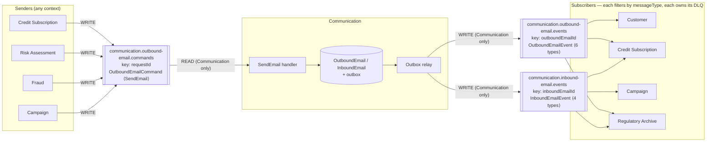

# ADR-002: Kafka Topic Layout and Event-Type Strategy — Several Event Types per Topic

**Status:** Accepted
**Date:** 2026-09-18 · **Revised:** 2026-09-21 (bank domain: senders are Credit Subscription, Risk Assessment, Fraud, Campaign; added the Regulatory Archive consumer)
**Deciders:** Pascoal Bayonne (Tech Lead), Communication domain team, Platform/Kafka team
**Bounded context:** Communication (the rules are written to be adopted org-wide)
**Related:** Builds on [ADR-001 — Email in the Communication Context: Aggregates, the `SendEmail` Command and Email Events](ADR-001-inbound-and-outbound-email-aggregates.md)
**Tags:** event-driven architecture, Kafka, topic design, Avro, Schema Registry, ordering, schema evolution

---

## Context

[ADR-001](ADR-001-inbound-and-outbound-email-aggregates.md) defines what Communication exchanges:

- **1 command:** `SendEmail`
- **6 outbound events:** `OutboundEmailQueued`, `…Rejected`, `…Sent`, `…DeliveryFailed`, `…Delivered`, `…Bounced`
- **4 inbound events:** `InboundEmailReceived`, `…Processed`, `…Ignored`, `…Quarantined`

That's **11 message types**. This ADR decides:

1. **How many topics:** one per event type, one per aggregate, or one per bounded context?
2. **How several event types share a topic under Schema Registry:** which subject name strategy, and which Avro structure?
3. **How to add event types later** without breaking, or silently corrupting, existing consumers.
4. **How ordering is kept** from the aggregate, through the producer, broker and consumer, including retries.

### What the literature says

Martin Kleppmann, *Should You Put Several Event Types in the Same Kafka Topic?* ([Confluent](https://www.confluent.io/blog/put-several-event-types-kafka-topic/), [author's blog](https://martin.kleppmann.com/2018/01/18/event-types-in-kafka-topic.html)) gives these criteria, most important first:

| # | Criterion | What it means here |
|---|---|---|
| 1 | **Ordering.** Events that must stay in a fixed order go in the **same topic with the same key** | `Queued → Sent → Bounced` for one email must never be seen as `Bounced → Sent` |
| 2 | **Entity.** Events about the same entity belong together; unrelated entities owned by different teams belong apart | Events of one aggregate share a topic |
| 3 | **Consumers.** If the same consumers always subscribe to the same group of topics, merge them. Reading and discarding unwanted events is cheap, unless consumers would throw away almost everything (~99%) | Subscribers usually want several outbound outcomes at once |
| 4 | **Throughput.** Keep very high-volume types apart from low-volume types that some consumers want on their own | Transactional credit email is low volume; a Campaign send to a pre-approved population is not. Watch per-recipient `Delivered` during campaigns |
| 5 | **Compound events.** Record a multi-entity fact once, as one message; split it later by stream processing if needed | One bounce notification = one event, with the recipient(s) inside |
| 6 | **Event sourcing.** Everything that defines an aggregate goes in one topic | We don't use event sourcing (the database is the system of record), but rule 1 already applies |
| 7 | **Default.** Only when none of the above applies, split by event type | Doesn't apply here |

Kleppmann also describes the Schema Registry **subject name strategies** that allow several types per topic: `TopicNameStrategy` (the default, one schema per topic), `RecordNameStrategy` and `TopicRecordNameStrategy`.

Robert Yokota's follow-up, [*Putting Several Event Types in the Same Topic — Revisited*](https://www.confluent.io/blog/multiple-event-types-in-the-same-kafka-topic/) (Confluent, 2020), adds a fourth option. You keep `TopicNameStrategy` and register the topic's schema as a **top-level union of references** to separately registered event schemas. This keeps a per-topic limit on which types are allowed, and the post notes it is the option ksqlDB can query. It requires `auto.register.schemas=false` and `use.latest.version=true`, and the referenced schemas must be registered by hand first.

### What we verified

Every Avro option that puts several types in one topic depends on how Avro **unions evolve**. So we tested it, using Avro 1.12.0 (Java) and our real `OutboundEmailEvent.avsc` as v1. For v2 we added one union branch, `OutboundEmailDelivered`. Old consumers read with v1; new producers write with v2.

| Test | Result |
|---|---|
| v2 reader, v1 data (BACKWARD) | ✅ Compatible |
| v1 reader, v2 data (FORWARD) | ❌ Incompatible, according to `SchemaCompatibility` |
| v1 consumer reads an existing type (`OutboundEmailSent`) written with v2 | ✅ Reads correctly |
| v1 consumer reads the **new** type `OutboundEmailDelivered` | ⚠️ **No error. It is read as `OutboundEmailQueued`** |
| Probe: new branch; no known branch can structurally accept it | ❌ `AvroTypeException: Found Delivered, expecting union[Sent, Failed]` |
| Probe: new branch; a known branch has all fields defaulted | ⚠️ **Silently read as that branch** (`Sent {gatewayReference: null}`) |

**Conclusion.** When a reader meets a union branch it doesn't know by name, it falls back to the first known record branch that can structurally accept it. Empty records, and records whose fields all have defaults, accept anything.

So a consumer that hasn't been upgraded either **crashes** or, worse, **acts on the wrong event**. Imagine an old consumer that hears "queued" when the email was actually delivered, or "sent" when it actually bounced. Our current schemas contain three such branches that accept anything: `OutboundEmailQueued`, `OutboundEmailSent` and `InboundEmailProcessed`.

Any option we choose must deal with this. Rolling out consumers first ("upgrade every subscriber before producers emit the new type") only works if every subscriber, in every team, is upgraded in time. That is an organisational promise, not a technical guarantee.

## Decision

### D1 — Topic layout: one topic per aggregate and message kind

```
<owning-context>.<aggregate>.<commands|events>
```

| Topic | Contents | Key | Why these belong together |
|---|---|---|---|
| `communication.outbound-email.commands` | `SendEmail` (and future commands such as `CancelScheduledEmail`) | `requestId` | Commands about the same email must stay in order (Send before Cancel) |
| `communication.outbound-email.events` | All 6 `OutboundEmail…` events | `outboundEmailId` | Ordering + same entity (criteria 1, 2) |
| `communication.inbound-email.events` | All 4 `InboundEmail…` events | `inboundEmailId` | Ordering + same entity (criteria 1, 2) |

Rules:

- **Commands and events never share a topic.** They have different owners (the consumer owns a command, the publisher owns an event), different access rules, different retention and different consumer counts (see ADR-001).
- **Inbound and outbound events don't share a topic.** They are different aggregates, with no ordering relationship between them and largely different subscribers.
  - *Known limitation:* nothing guarantees that a reply (`OutboundEmailSent`) is seen after the `InboundEmailReceived` it answers. Consumers that build conversation timelines put emails in order using `inReplyTo`, `causationId` and `occurredAt`, not by arrival order.
- **No topic per event type.** That would break criterion 1: a consumer reading `…bounced` and `…sent` topics separately could process the bounce before the send.
- **No single `communication.events` topic for everything.** It would tie unrelated aggregates' throughput, retention and schema changes together for no ordering benefit.
- **Every command topic carries the same key for every command about the same email**, even if that email doesn't exist yet. That's why commands are keyed by the sender-generated `requestId` (and `CancelScheduledEmail` will carry `requestId` too), not by the `outboundEmailId` that Communication assigns later.

### D2 — Schema strategy: envelope record + payload union, under `TopicNameStrategy`

Each topic has **one registered value schema**, an *envelope* record. Its `payload` field is a union of the event (or command) records allowed on that topic. This is the structure already in `OutboundEmailEvent.avsc` and `InboundEmailEvent.avsc`, with the additions in D3.

```
OutboundEmailEvent (envelope, subject: communication.outbound-email.events-value)
├── metadata: EventMetadata { messageId, messageType, occurredAt, source, correlationId, causationId }
├── outboundEmailId
├── aggregateVersion                 ← new (D4)
├── requestId, reference             ← from ADR-001
├── content, dispatchStatus, …       ← current state of the email
└── payload: union [ OutboundEmailQueued | OutboundEmailRejected | OutboundEmailSent |
                     OutboundEmailDeliveryFailed | OutboundEmailDelivered | OutboundEmailBounced ]
```

Commands use the same structure: `OutboundEmailCommand { metadata, requestId, payload: union [SendEmail] }`. The union has **one branch today**, so adding `CancelScheduledEmail` later only adds a branch. Changing a plain `SendEmail` record into an envelope later would be a breaking change.

Why this option (compared in *Options Considered*):
- It works with **default serializer settings** and gives **one reviewable contract per topic**.
- The set of types allowed on a topic is **fixed and enforced by the Registry**.
- It carries **metadata and aggregate state common to all events**, which a bare union of references can't do without repeating them in every event schema.

### D3 — Consumers tell event types apart by an explicit type field, never by payload class

This is the fix for the silent misread we verified:

1. **`metadata.messageType`**, a required `string`, is the one source of truth for what an event means. Format: `com.bank.communication.<MessageName>` (e.g. `com.bank.communication.OutboundEmailBounced`). It is stable and independent of the Avro namespace or version, and each name is used only once.
2. **The same value goes in the CloudEvents `ce_type` Kafka header**, set together with the other CloudEvents binary-mode headers (`ce_specversion`, `ce_id`, `ce_source`, `ce_time`, `ce_subject` = aggregate ID). Consumers and tools can then filter **without deserializing**.
3. **Consumers look at `messageType` first and only then read the `payload`.** A type the consumer doesn't know, or doesn't care about, is **skipped and committed**, never guessed from the payload's class:

   ```java
   @KafkaListener(topics = "communication.outbound-email.events", groupId = "customer.outbound-email")
   void on(ConsumerRecord<String, OutboundEmailEvent> record) {
       OutboundEmailEvent event = record.value();
       if (versions.alreadySeen(event.getOutboundEmailId(), event.getAggregateVersion())) {
           return;                                             // duplicate or stale (D4)
       }
       switch (event.getMetadata().getMessageType()) {
           case "com.bank.communication.OutboundEmailBounced" ->
               handleBounce(event, (OutboundEmailBounced) event.getPayload());
           default -> { }                                      // unknown or irrelevant: skip, never guess
       }
   }
   ```
4. **Deserialization failures are also checked against the type.** Consumers wrap the Avro deserializer in `ErrorHandlingDeserializer`. If a record can't be deserialized and its `ce_type` header is a type the consumer doesn't handle, it is skipped. Otherwise it goes to the consumer's dead-letter topic.
5. **Every union branch has at least one required field with no default.** Empty records and all-default records are not allowed (for example, `OutboundEmailQueued` gets `queuedAt`). This makes structural fallback less likely, but D3.1–D3.3 remain the actual guarantee.

With D3 in place, **adding an event type doesn't depend on deployment order**. Consumers that haven't been upgraded either skip it by type, or fail to deserialize it and skip it by header.

### D4 — Ordering from the aggregate to the consumer

Keying is only one link in the chain. Every link must preserve order:

| Link | Rule |
|---|---|
| Aggregate | Every change increments **`aggregateVersion`** (a `long`, per aggregate, gap-free). It is published in the envelope. |
| Outbox | The transactional outbox relay publishes each aggregate's events **in commit order**, one aggregate at a time. |
| Producer | `enable.idempotence=true`, `acks=all`, `max.in.flight.requests.per.connection ≤ 5` (idempotent producers keep order at this setting). Key = aggregate ID, serialized as a plain UTF-8 string, so every language partitions it the same way. |
| Topic | Partition count is set when the topic is created and sized for peak load with headroom. **Never increase it on an ordered topic** without a migration plan: doing so changes which partition a key goes to, which breaks per-key ordering during the change. |
| Consumer | One partition at a time. Tools that process in parallel must be configured to keep per-key order (e.g. key-ordered mode). |
| Retries | **Don't use non-blocking retry topics** (e.g. Spring `@RetryableTopic`) on ordered topics. They move a failing event aside while later events for the same key carry on, which reorders them. Use **blocking retries with backoff**, then the consumer's own dead-letter topic. |
| Duplicates and gaps | Consumers keep the last `aggregateVersion` they applied per aggregate. They drop duplicates and stale events (`≤ last`). They detect gaps (`> last + 1`) after something has gone to the dead-letter topic, and can recover because every event carries the aggregate's current state. |

### D5 — Topic ownership, retention and dead-letter topics

| Topic | Writes | Reads | Retention | Dead-letter topic owned by |
|---|---|---|---|---|
| `communication.outbound-email.commands` | Allowed senders | Communication only | Short (e.g. 7 days): a command is only useful until it's handled | Communication: `communication.outbound-email.commands.dlq` |
| `communication.*-email.events` | Communication only | Subscribers | Time-based (e.g. 30 days, for consumer recovery). Not compacted: compaction would delete history | **Each consumer**: `<consumer-context>.<source-topic>.dlq` |

- **Events are integration events, not the system of record.** A new subscriber that needs history older than the retention period gets it from a Communication query API or a snapshot, not by replaying the topic forever.
- **Regulatory evidence does not live in Kafka.** Proof that a SECCI, an ESIS or a contract copy was sent, delivered or bounced must be kept for years. The Regulatory Archive consumer writes it to the archive; topic retention stays at ~30 days and is only a transport buffer.
- **A compacted `…outbound-email.state` topic** (latest snapshot per key) is a separate decision, to be made only if a consumer needs a table view.

### D6 — Schema Registry rules

- **Subject strategy:** `TopicNameStrategy` for keys and values. Subjects: `<topic>-value`. Keys are plain strings.
- **Compatibility:** `BACKWARD_TRANSITIVE` on every subject. `FULL` isn't possible: adding a union branch is never forward-compatible (verified above).
- **Registration:**
  - Producers run with `auto.register.schemas=false`.
  - Schemas are registered and compatibility-checked **in CI** (`kafka-schema-registry-maven-plugin`: `test-compatibility`, then `register`), from the schema module in git.
  - The union-evolution test we used for this ADR becomes a CI check. For every new version, each writer branch must either match a same-named branch in the previous version or be listed as newly added.
- **Removing or renaming an event type or field is a breaking change.** It is never done in place. The type is deprecated (documented, no longer produced, still readable). A real break means a new topic (`…events.v2`), dual publishing during migration, and a later ADR.
- **Enums keep an `UNKNOWN` default symbol** (already done), so adding a symbol is safe for old readers.

### Resulting topology



## Options Considered

### Topic layout

| Option | Ordering per aggregate | Consumer ergonomics | Operational cost | Verdict |
|---|---|---|---|---|
| T1. One topic per event type (`…outbound-email.bounced`, …) | ❌ Lost across topics | Consumers join topics and re-sort | 11+ topics, more partitions | Rejected (criterion 1) |
| **T2. One topic per aggregate and message kind** | ✅ Same topic, same key | Subscribe once, filter by type | 3 topics | **Chosen** |
| T3. One topic per bounded context (`communication.events`) | ✅ (no worse than T2) | Inbound-only consumers discard outbound traffic | Throughput, retention and schema changes shared by unrelated aggregates | Rejected (criteria 2, 4) |
| T4. Commands and events in the same topic | — | Confusing: ownership and consumer count differ | Can't apply correct access rules or retention | Rejected (ADR-001 ownership rules) |

### Schema strategy

#### S1. Envelope record + payload union, `TopicNameStrategy` — **chosen**

| Dimension | Assessment |
|---|---|
| Complexity | Low. Default serializer config, one subject per topic |
| Type constraint per topic | ✅ The union lists exactly the allowed types |
| Independent evolution per type | ❌ Every type evolves inside one subject |
| Shared metadata and state | ✅ Defined once in the envelope |
| Adding a type | Backward-compatible only. Safe only because of D3 |
| Tooling (Connect, ksqlDB, Flink SQL) | One record schema per topic. How union *fields* map varies by tool — check before relying on it |

#### S2. Top-level union of schema references, `TopicNameStrategy` (Yokota, 2020)

| Dimension | Assessment |
|---|---|
| Complexity | Medium–High. Every event schema registered separately first; `auto.register.schemas=false`, `use.latest.version=true` |
| Type constraint per topic | ✅ |
| Independent evolution per type | ✅ Each referenced event schema has its own subject |
| Shared metadata and state | ❌ Repeated in every event schema, or pulled out into another referenced type |
| Adding a type | Also a union change, so it still needs the D3 guard. We verified the envelope case only; union-of-references uses the same Avro rules for resolving union branches |
| Tooling | Confluent notes it is the option that ksqlDB can query when a topic has several types |

**Strongest alternative.** See *Revisit triggers*.

#### S3. `TopicRecordNameStrategy` (one subject per topic + record type)

| Dimension | Assessment |
|---|---|
| Complexity | Low for producers |
| Type constraint per topic | ❌ The Registry accepts **any** record type on the topic. Only producer discipline limits it |
| Independent evolution per type | ✅ |
| Adding a type | There's no union, so no structural fallback. Consumers still need a rule for unknown types |
| Tooling | Weak: tools that assume one schema per topic handle it poorly |

**Rejected.** It gives up the per-topic contract that makes the event catalogue governable.

#### S4. `RecordNameStrategy` (one subject per record type, across all topics)

**Rejected.** Compatibility is checked across every topic that uses the type, which ties unrelated topics together, and there's no per-topic limit on types.

#### S5. Schemaless JSON with a `type` field

**Rejected.** No Registry-enforced compatibility, no generated types, and it contradicts the Avro decision.

## Trade-off Analysis

- **Ordering decides the topics; the schema strategy decides the rest.** Kleppmann's first criterion settles T2. The other criteria (consumers, throughput) confirm it at our volumes. Once several types share a topic, the real question is how those types evolve.
- **Unions are more dangerous than they look.** "Backward-compatible" sounds safe, but the Registry only checks that *new* readers can read *old* data. Our test shows that *old* readers of *new* data may silently misread it. S1 and S2 both inherit this, and S3 avoids it only by giving up the per-topic contract. D3 (dispatch by explicit type, skip unknown types) removes the risk at the consumer, which is the only place it can be removed. It also means we don't depend on every team deploying in the right order.
- **S1 vs S2 is a trade between simplicity and independent evolution.**
  - S1: one schema per topic to review and register, with shared metadata and state in one place.
  - S2: each event type versioned on its own, and ksqlDB can query the topic.
  - With 6 and 4 event types, owned by one team and published by one producer, S1's simplicity wins. S2 becomes worth it when several teams own event types, or when the envelope becomes a coordination bottleneck.
- **Carrying the aggregate's state in every event** (`content`, `dispatchStatus`, `aggregateVersion`) makes events larger, but consumers become simpler and able to recover. A consumer that missed an event (dead-letter topic, gap) still has the email's current state from the next one.

## Consequences

**Easier:**
- Per-email ordering is guaranteed from the database to the consumer, and consumers can check it with `aggregateVersion`.
- Adding an event type is safe no matter which consumers have been upgraded.
- One subscription per aggregate gives a consumer the whole lifecycle.
- Topic ownership, retention and dead-letter responsibility are unambiguous and enforced by access rules.
- Schema changes are reviewed as pull requests and checked in CI before reaching the Registry.

**Harder:**
- Consumers must follow the dispatch rule in D3. It becomes part of our consumer template or library and of code review.
- Blocking retries on ordered topics can hold up a partition behind one bad event. The dead-letter topic plus gap detection limit this, but it needs monitoring (consumer lag alerts).
- Every event type evolves inside one envelope subject, so changes to two types at once must be coordinated.
- CloudEvents headers and `metadata.messageType` carry the same value. The outbox relay must set both from one source.

**Revisit triggers — reopen this ADR if:**
- **Several teams own event types in the same topic**, or independent versioning per type becomes a real need → move to S2 (top-level union of references).
- **ksqlDB or Flink SQL must query these topics** and can't handle the envelope's union field → evaluate S2.
- **One event type dominates throughput** (e.g. per-recipient `OutboundEmailDelivered` during a Campaign send to a pre-approved population) and consumers discard ≳99% of events → add a Communication-owned **derived topic** (e.g. `communication.outbound-email.bounces`, same key) produced by Kafka Streams. Don't split the source topic.
- **A consumer needs strict ordering across inbound and outbound emails in a thread** → consider a thread-keyed topic owned by Communication.
- **Event sourcing** is adopted for these aggregates → retention becomes infinite and this ADR is superseded.

## Action Items

1. [ ] Add `messageType` (required string) to `EventMetadata`, and `aggregateVersion` (long) to both event envelopes.
2. [ ] Remove the empty and all-default union branches:
   - `OutboundEmailQueued` gets a required `queuedAt`
   - `OutboundEmailSent` gets a required `sentAt`
   - `InboundEmailProcessed` gets a required `processedAt`
3. [ ] Create `OutboundEmailCommand.avsc` (envelope with `payload: [SendEmail]`), replacing the plain `SendEmail` planned in ADR-001, action item 1.
4. [ ] Add the union-evolution test (writer branch ↔ previous reader branch) and `test-compatibility` to the schema module's CI.
5. [ ] Set `BACKWARD_TRANSITIVE` compatibility on all three subjects. Register the schemas from CI only (`auto.register.schemas=false`).
6. [ ] Outbox relay: publish in commit order per aggregate, and set the CloudEvents headers (`ce_type` = `messageType`, `ce_id` = `messageId`, `ce_subject` = aggregate ID).
7. [ ] Producer configuration: `enable.idempotence=true`, `acks=all`, `max.in.flight.requests.per.connection ≤ 5`, string keys.
8. [ ] Create the topics with fixed partition counts, retention as in D5, and Kafka access rules as in D5 and ADR-001.
9. [ ] Build a consumer template or library:
   - dispatch on `messageType`, skip unknown types
   - `ErrorHandlingDeserializer` with the header check
   - `aggregateVersion` checks for duplicates and gaps
   - blocking retries, then the consumer-owned dead-letter topic
10. [ ] Add Messaging integration tests (Testcontainers Kafka + Schema Registry) for:
    - ordering per key
    - an old consumer receiving a new event type (must skip, not misread)
    - dead-letter handling and gap detection
11. [ ] Document the three topics, their message types, owners and consumers in the event catalogue.

## References

- Martin Kleppmann, *Should You Put Several Event Types in the Same Kafka Topic?* — Confluent blog, 2018. <https://www.confluent.io/blog/put-several-event-types-kafka-topic/> · <https://martin.kleppmann.com/2018/01/18/event-types-in-kafka-topic.html>
- Robert Yokota, *Putting Several Event Types in the Same Topic — Revisited* — Confluent blog, 2020. <https://www.confluent.io/blog/multiple-event-types-in-the-same-kafka-topic/>
- Apache Avro 1.12 specification — schema resolution for unions.
- CloudEvents — Kafka protocol binding (binary content mode headers `ce_*`).
- [ADR-001](ADR-001-inbound-and-outbound-email-aggregates.md) — aggregates, the `SendEmail` command, event catalogue, topic ownership.
- Verification tests `UnionEvolutionTest` and `UnionFallbackProbeTest` (Avro 1.12.0), run on 2026-09-18 against `OutboundEmailEvent.avsc`.
