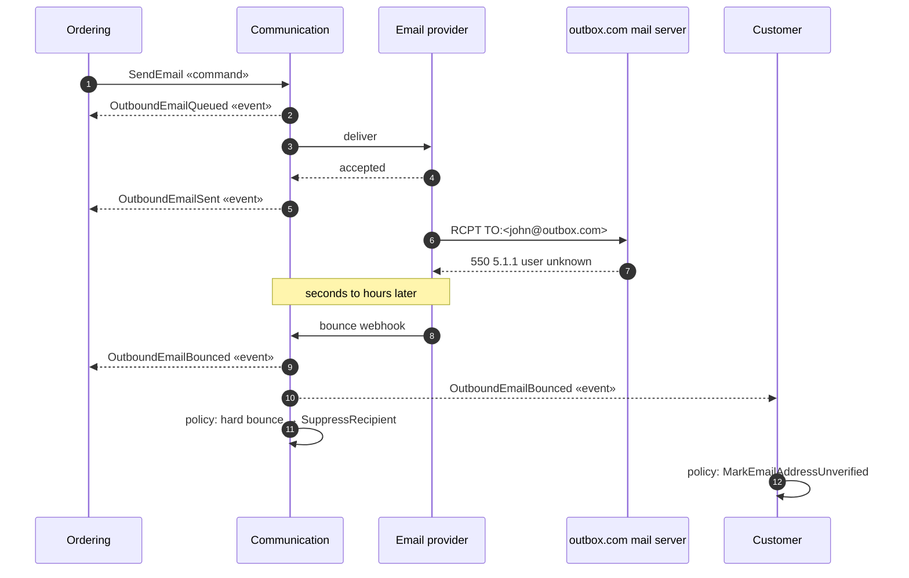

# Commands, Events and Kafka Topics — A Practical Guide

**A team guide, told through one real example: the Communication service that sends and receives our emails.**

Audience: backend engineers working on any service that publishes or consumes messages.
Reading time: ~20 minutes. Also usable as a 45-minute session (see [Running this as a session](#running-this-as-a-session)).
Decisions behind it: [ADR-001](../adr/ADR-001-inbound-and-outbound-email-aggregates.md) · [ADR-002](../adr/ADR-002-kafka-topic-and-event-type-strategy.md) · Schemas: `communication-avro/`

---

## The ten rules, in one page

1. **Name the thing after what it is, not what it looks like.** Two aggregates, `OutboundEmail` and `InboundEmail`, not one `Email` with a direction flag.
2. **A command asks for something; an event states a fact.** `SendEmail` vs `OutboundEmailSent`.
3. **A command has exactly one consumer, and that consumer owns its schema.** An event has one publisher, who owns its schema, and any number of subscribers.
4. **Never name an event after something that didn't happen.** `OutboundEmailBounced`, never `EmailNotSent`.
5. **Put the reason in the data, not in the name.** `bounceReason: RECIPIENT_NOT_FOUND`.
6. **Events that must stay in order share one topic and one key.** For us: one topic per aggregate, keyed by the aggregate's ID.
7. **Never mix commands and events in one topic.** Different owners, different access rules, different retention.
8. **Consumers decide what a message is by an explicit `messageType` field, never by the class they deserialized.**
9. **Use `BACKWARD_TRANSITIVE` compatibility.** It is the only setting that lets us add message types, and it keeps old data readable.
10. **Don't use non-blocking retry topics on ordered topics.** They reorder events for the same key.

---

## Part 1 — Naming the domain

We had to store every email we send, and every email we receive. They carry the same fields: sender, recipients, subject, body, attachments. So: one `Email` class?

No. **Aggregate boundaries follow rules, not fields.**

| | Email we send | Email we receive |
|---|---|---|
| Who creates it | We do | The outside world does |
| Lifecycle | Queued → Sent → per recipient: Delivered or Bounced. Or Rejected, or Failed | Received → Processed, Ignored or Quarantined |
| Rules | At least one recipient, verified sender, retry limit, never sent twice | No duplicates by `Message-ID`, never processed twice |
| Worst bug | Sending twice, or silently not sending | Processing the same provider webhook twice |

One class holding both would need `sentAt` empty for received mail, `receivedAt` empty for sent mail, and a direction check in every method. Neither set of rules could be enforced properly.

**Names we rejected, and why** — this table is the part worth memorising, because the same traps appear in every domain:

| Name | Why not |
|---|---|
| `Email` | Clashes with the email-address value object, and hides direction |
| `EmailMessage` + `Direction` | Fields that are empty half the time; `if (direction == …)` everywhere |
| `SentEmail` / `ReceivedEmail` | Describe one moment, not a lifecycle. A "sent" email may still be queued or rejected |
| `EmailEntity`, `EmailRecord`, `EmailLog` | Database words. Fine in an adapter, never in the domain |
| `EmailNotification` | Mixes why (a notification) with how (email) |
| `Mail`, `Message` | Clash with `jakarta.mail` and with Kafka/JMS messages |

> **Take-away:** if a name needs a flag to tell you what it is, it's two names.

---

## Part 2 — Commands vs events

### The distinction

| | **Command** | **Event** |
|---|---|---|
| Means | "Please do this" | "This happened" |
| Name | Imperative: `SendEmail` | Past tense: `OutboundEmailSent` |
| Consumers | **Exactly one** | **Zero to many** |
| Producers | Many | **Exactly one** |
| Who owns the schema | The **consumer** | The **publisher** |
| Can it be refused? | Yes | No. The past can't be refused; subscribers only choose how to react |
| Delivery | Point to point | Publish/subscribe |

Sources: [CodeOpinion](https://codeopinion.com/commands-events-whats-the-difference/) and [EDA Visuals](https://eda-visuals.boyney.io/visuals/commands-vs-events).

The flow to remember: **a command causes behaviour → the behaviour produces events → subscribers react independently → a subscriber's reaction may be a new command.**

### How that lands in Communication

- **Sending is a command: `SendEmail`.** Ordering decides *when and why* ("order placed, so send a confirmation"). Communication decides *how*. Communication does **not** subscribe to `OrderPlaced`, because a generic service must not have to learn every domain's language.
- **Communication owns the `SendEmail` schema**, even though it never sends the command. The one who does the work defines the request.
- **Outcomes come back as events**, never as a reply. A bounce can arrive hours later, long after any request/response has ended.

### The story: `john@outbox.com` couldn't be found

Someone proposed an `EmailNotSent` event for this. Here's why that name is wrong:



**The email was sent.** The provider accepted it and attempted delivery. What failed was delivery to one recipient, reported afterwards. And "not sent" merges three situations that need opposite reactions:

| What happened | Event | What a consumer should do |
|---|---|---|
| A rule refused it; nothing was sent | `OutboundEmailRejected` | Fix the data. Resending as-is is pointless |
| We couldn't hand it to the provider | `OutboundEmailDeliveryFailed` (`retryable`) | Retry, or alert when final |
| The recipient's server refused it | `OutboundEmailBounced` (HARD/SOFT) | Block the address; mark it unverified |

With one `EmailNotSent`, every consumer would have to parse a free-text reason to work out which of the three it was.

### Naming rules we follow

**Commands** — `<Verb><Noun>`, imperative, in the *receiver's* language:
- ✅ `SendEmail`, `CancelScheduledEmail`
- ❌ `CreateEmail` (CRUD), `EmailToSend` (a noun), `SendEmailCommand` (redundant suffix)
- ❌ `NotifyCustomer` — that's Ordering's own command; its handler then sends `SendEmail`

**Events** — `<Aggregate><PastTenseVerb>`, a positive, specific fact:
- ✅ `OutboundEmailBounced`, `InboundEmailQuarantined`
- ❌ `EmailNotSent` (a non-event), `EmailFailed` (vague), `SendEmailFailed` (named after the command)
- ❌ `OutboundEmailUpdated`, `EmailStatusChanged` — CRUD events force consumers to diff state to find out what happened
- ❌ `EmailRequested` — a command wearing an event's clothes. If you expect one specific service to act, it's a command

**Both:** no `Command` or `Event` suffix; the package and topic say which it is.

> **Take-away:** an event name should tell a consumer what to do without opening the payload.

---

## Part 3 — Topic design

Martin Kleppmann's criteria ([Confluent](https://www.confluent.io/blog/put-several-event-types-kafka-topic/)), most important first: **ordering**, then **which entity the events are about**, then **consumers**, then **throughput**. Splitting by event type is the *least* important consideration.

Our layout, `<context>.<aggregate>.<commands|events>`:

| Topic | Key | Carries |
|---|---|---|
| `communication.outbound-email.commands` | `requestId` | `SendEmail` (later: `CancelScheduledEmail`) |
| `communication.outbound-email.events` | `outboundEmailId` | 6 outbound event types |
| `communication.inbound-email.events` | `inboundEmailId` | 4 inbound event types |

Why not one topic per event type? Because a consumer reading `…sent` and `…bounced` separately could process the bounce **before** the send. Kafka only orders within a partition, and the key is what keeps one email's events on one partition.

**Ordering is a chain — every link matters:**

| Link | Rule |
|---|---|
| Aggregate | Every change bumps `aggregateVersion` (1, 2, 3, …), published in the event |
| Outbox | The relay publishes each aggregate's events in commit order |
| Producer | `enable.idempotence=true`, `acks=all`, key = aggregate ID as a plain string |
| Topic | Partition count fixed at creation. Increasing it re-maps keys to partitions and breaks ordering |
| Consumer | One partition at a time; parallel processing only in key-ordered mode |
| Retries | **Blocking retries with backoff, then a dead-letter topic.** Non-blocking retry topics (`@RetryableTopic`) let later events for the same key overtake the failed one |

**Ownership through access rules**, not convention:
- Command topic: many services may write, **only Communication may read**.
- Event topics: **only Communication may write**, subscribers may read.
- Dead-letter topics: the command DLQ belongs to Communication; each *consumer* owns its own DLQ for the event topics.

> **Take-away:** ordering picks your topics. Everything else is a tiebreaker.

---

## Part 4 — Schema design

One registered schema per topic: an **envelope** whose `payload` is a union of the allowed message types.

```
OutboundEmailEvent  (topic: communication.outbound-email.events)
├── metadata { messageId, messageType, occurredAt, source, correlationId, causationId }
├── outboundEmailId          ← the Kafka key
├── aggregateVersion         ← detect duplicates and gaps
├── requestId, reference     ← trace back to the SendEmail that caused it
├── content, dispatchStatus, attempts, queuedAt, deliveries[]   ← current state
└── payload: union [ Queued | Rejected | Sent | DeliveryFailed | Delivered | Bounced ]
```

Three details worth copying into other services:

1. **Attachments are links, never bytes.** `attachmentId`, `fileName`, `contentType`, `sizeBytes`, `sha256Checksum`, `downloadUri`. The URI must be **stable and authenticated, never pre-signed**: messages outlive a pre-signed URL, and anyone who can read the topic would otherwise gain access to the file.
2. **Delivery is tracked per recipient** (`deliveries[]`). An email to three people can reach two and bounce for one. A single email-level status can't express that.
3. **The command envelope has a one-branch union today.** Adding `CancelScheduledEmail` later is then just another branch. Turning a bare `SendEmail` record into an envelope later would be a breaking change.

---

## Part 5 — Schema Registry compatibility, precisely

The check compares your **candidate schema** against **registered version(s)**.

| Type | Meaning | Allows | Checked against | Who upgrades first |
|---|---|---|---|---|
| **BACKWARD** (default) | New schema reads data written with the previous version | Add field **with default**; delete any field | Last version | Consumers |
| **BACKWARD_TRANSITIVE** | New schema reads data written with **all** earlier versions | Same | All versions | Consumers |
| **FORWARD** | Previous version reads data written with the new schema | Add any field; delete field **that has a default** | Last version | Producers |
| **FORWARD_TRANSITIVE** | **All** earlier versions read new data | Same | All versions | Producers |
| **FULL** | Both directions, previous version | Add/delete **defaulted** fields only | Last version | Either |
| **FULL_TRANSITIVE** | Both directions, all versions | Same | All versions | Either |
| **NONE** | No check | Anything | — | — |

Two Avro facts that decide the choice:
- **Adding an enum symbol** is always backward-compatible, and forward-compatible only if the older schema declared an enum `default`. Ours all declare `UNKNOWN`.
- **Adding a union branch** (a new message type) is backward-compatible but **never** forward-compatible.

### Our setting: `BACKWARD_TRANSITIVE` on all three subjects

1. It is **the only setting that lets us add message types**. `FULL`, `FORWARD` and their transitive forms would freeze the catalogue at today's 6 + 4 + 1.
2. **Transitive**, because events stay on the topic for weeks. A consumer must read data written by *any* schema still in retention, not just the previous one.
3. It **fits the command topic exactly**: `BACKWARD` assumes consumers upgrade first, and the command topic's only consumer is Communication itself.
4. Its weak spot — old consumers reading new data — is closed **in the application**, not the registry (Part 6).
5. **House rule:** add fields only with defaults and never rename or delete one. Then everyday changes are compatible in both directions anyway, and the loosened direction is used for exactly one thing: adding a message type.

Never `NONE`. A breaking change means a new topic (`…events.v2`) with dual publishing, not a lowered setting.

---

## Part 6 — The trap we found (please read this one)

"Backward compatible" sounds safe. It isn't the whole story, and we proved it with a test on our own schema.

We added a new event type, `OutboundEmailDelivered`, and let a consumer still on the **old** schema read it:

| Situation | Result |
|---|---|
| New consumer, old data | ✅ Fine |
| Old consumer, an event type it knows | ✅ Fine |
| **Old consumer, the new event type** | ⚠️ **No error. It was read as `OutboundEmailQueued`** |

When Avro meets a union branch it doesn't know by name, it falls back to the first known branch that structurally fits. **Empty records, and records whose fields all have defaults, fit anything.** An old consumer would have believed the email was still queued when it had actually been delivered. The Schema Registry cannot catch this: it only checks that *new* consumers can read *old* data.

**The three rules that came out of it:**

1. **Dispatch on `metadata.messageType`**, a required string like `com.acme.communication.OutboundEmailBounced`, repeated in the CloudEvents `ce_type` header. **Never** decide from the deserialized class.
2. **Skip unknown types** — commit and move on. Wrap the deserializer in `ErrorHandlingDeserializer`, and if a record that fails to deserialize has a `ce_type` you don't handle, skip it too.
3. **No empty or all-default message types.** Every event record needs at least one required field (that's why `OutboundEmailQueued` carries `queuedAt`).

```java
@KafkaListener(topics = "communication.outbound-email.events", groupId = "customer.outbound-email")
void on(ConsumerRecord<String, OutboundEmailEvent> record) {
    OutboundEmailEvent event = record.value();
    if (versions.alreadySeen(event.getOutboundEmailId(), event.getAggregateVersion())) {
        return;                                            // duplicate or stale
    }
    switch (event.getMetadata().getMessageType()) {
        case "com.acme.communication.OutboundEmailBounced" ->
            handleBounce(event, (OutboundEmailBounced) event.getPayload());
        default -> { }                                     // unknown or irrelevant: skip, never guess
    }
}
```

After rule 3, the same test fails loudly instead: `AvroTypeException: Found …OutboundEmailComplained, expecting union[…]`. Loud beats silent. And with rule 1, consumers skip the type before it can hurt them, so **adding an event type no longer depends on every team deploying in the right order**.

> **Take-away:** schema compatibility protects the format. Only the consumer can protect the meaning.

---

## Runbooks

### Adding a new event type

1. Add the record as a union branch in the topic's `.avsc`. Give it at least one required field.
2. Add its `messageType` constant: `com.acme.communication.<EventName>`.
3. Run the schema tests (`mvn test` in `communication-avro`): rules, round-trip, and the unknown-type check.
4. CI runs `test-compatibility` against the registry (`BACKWARD_TRANSITIVE`), then registers on merge.
5. Publish it from the producer; document it in the event catalogue with owner and consumers.
6. Consumers adopt it when they need it. Those that don't, skip it.

### Adding a new command

1. Add the record as a branch of the command envelope.
2. Decide the key: it must match the other commands about the same thing (we key on `requestId`).
3. The **consumer** owns and reviews this schema — it's their contract.
4. Define its rejection event before you write the handler. Every command can be refused.

### Reviewing a message-related pull request

- [ ] Is a command named in the imperative, and an event in the past tense?
- [ ] Does the event name state what happened, not what didn't, and with no `Updated`/`Changed`?
- [ ] Is the reason typed data rather than part of the name or free text?
- [ ] Does the new event type have a required field (no empty or all-default records)?
- [ ] Is `messageType` set, and does the consumer dispatch on it rather than on the payload class?
- [ ] Does the topic and key preserve the ordering this message needs?
- [ ] For a command: exactly one consumer, and do they own the schema?
- [ ] Are attachments or large blobs links rather than bytes?
- [ ] No non-blocking retry topic on an ordered topic?

---

## Running this as a session

A 45-minute walkthrough that works well:

1. **(5 min)** Show the `EmailNotSent` proposal. Ask the room: is it a command or an event, and is the name right?
2. **(10 min)** Part 1 and Part 2: names, then the bounce diagram.
3. **(10 min)** Part 3: why one topic per aggregate, and the ordering chain.
4. **(10 min)** Part 6: run the union test live, and watch a new event type get read as an old one.
5. **(10 min)** Apply it to a service of your own: what are its commands, its events, its topics and its keys?

**Discussion questions:**
- Where in *your* service is there an `Email`-style name that hides two different things?
- Which of your events are really commands in disguise?
- If a consumer of yours lags two schema versions, what breaks?
- Which of your topics would lose ordering if someone doubled the partition count tomorrow?

---

## Glossary

| Term | Meaning |
|---|---|
| **Command** | "Do this." One consumer, who owns the schema. Can be refused |
| **Event** | "This happened." One publisher, who owns the schema. 0..n subscribers |
| **Policy** | *When* event X, *then* command Y (hard bounce → block the address) |
| **Aggregate** | The object that owns a set of rules and is changed as a whole (`OutboundEmail`) |
| **Envelope** | The single record per topic, whose `payload` union holds the message types |
| **messageType** | The field (and `ce_type` header) that says what a message is |
| **aggregateVersion** | Per-aggregate counter used to spot duplicates and gaps |
| **Sent vs Delivered** | Sent = the provider accepted it. Delivered = the recipient's server accepted it |
| **Hard / soft bounce** | Permanent (address doesn't exist) / temporary (mailbox full) |
| **Suppression** | Blocking future sends to an address after a hard bounce |

## Where everything lives

| What | Where |
|---|---|
| Aggregates, commands, events, naming | [ADR-001](../adr/ADR-001-inbound-and-outbound-email-aggregates.md) |
| Topics, envelope, ordering, compatibility | [ADR-002](../adr/ADR-002-kafka-topic-and-event-type-strategy.md) |
| Avro schemas for the three topics | `communication-avro/src/main/avro/` |
| Schema rules, round-trip and unknown-type tests | `communication-avro/src/test/java/` |
| Schema generator (one source for shared types) | `communication-avro/tools/generate_schemas.py` |

## Sources

- Martin Kleppmann, *Should You Put Several Event Types in the Same Kafka Topic?* — <https://www.confluent.io/blog/put-several-event-types-kafka-topic/>
- Robert Yokota, *Putting Several Event Types in the Same Topic — Revisited* — <https://www.confluent.io/blog/multiple-event-types-in-the-same-kafka-topic/>
- Derek Comartin, *Commands & Events: What's the difference?* — <https://codeopinion.com/commands-events-whats-the-difference/>
- David Boyney, *Commands vs Events* — <https://eda-visuals.boyney.io/visuals/commands-vs-events>
- Confluent Schema Registry — compatibility types. Apache Avro 1.12 — schema resolution.
